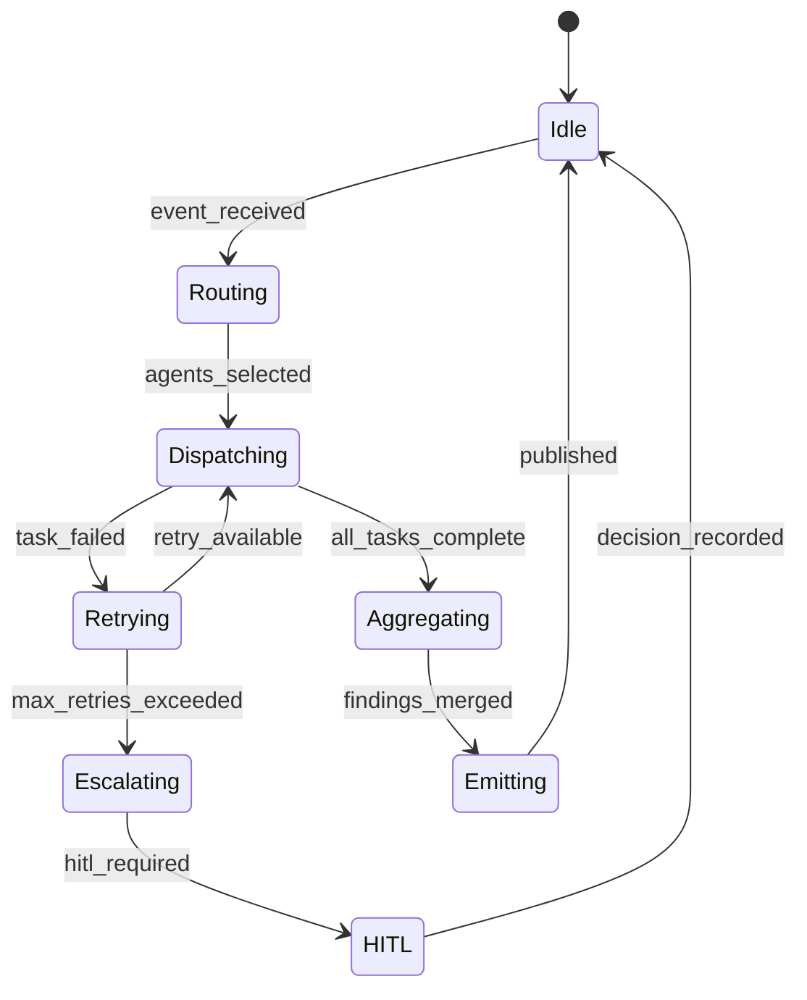

# Orchestrator Design (Week 1)

**Component:** `agents/orchestrator/agent.py`  
**Framework:** LangGraph + OpenClaw  
**Status:** Design approved — **dispatch implemented Week 2** (`packages/core/dispatch.py`)

---

## 1. Purpose

The Orchestrator is the **single entry point** for normalised security events. It:

1. Classifies event type and severity
2. Selects one or more specialist agents
3. Dispatches tasks in parallel where safe
4. Aggregates findings into a unified response
5. Escalates to HITL when confidence or severity thresholds are met

---

## 2. Agent state machine



| State | Description |
|-------|-------------|
| **Idle** | Listening on `unishield:agent:orchestrator:tasks` |
| **Routing** | Map event → agent list + priority |
| **Dispatching** | Publish to specialist task streams |
| **Retrying** | Exponential backoff (3 attempts, 2s / 4s / 8s) |
| **Aggregating** | Merge `AgentFinding` objects |
| **Emitting** | Publish to findings stream + optional DB persist |
| **HITL** | Queue when `should_require_hitl()` returns true |

---

## 3. Task routing logic

### 3.1 Event type → agent mapping

| Event type | Primary agents | Secondary agents |
|------------|----------------|------------------|
| `credential_leak` | dark-web-agent | threat-intel-agent, incident-response-agent |
| `code_commit` | source-code-agent | vulnerability-agent |
| `anomalous_login` | insider-threat-agent | siem-analysis-agent |
| `ioc_observed` | threat-intel-agent | forensics-agent, graph-query-agent |
| `cve_alert` | vulnerability-agent | compliance-agent, network-security-agent |
| `siem_alert` | siem-analysis-agent | incident-response-agent |
| `network_anomaly` | network-security-agent | graph-query-agent |
| `compliance_gap` | compliance-agent | reporting-agent |
| `unknown` | threat-intel-agent | orchestrator re-evaluates after first pass |

### 3.2 Priority queues (P0–P3)

| Priority | SLA | Parallel dispatch | Example |
|----------|-----|-------------------|---------|
| **P0** | 5 min | Yes — all mapped agents | Active breach, crown-jewel CVE exploited |
| **P1** | 15 min | Yes — up to 4 agents | Credential dump, critical SAST finding |
| **P2** | 2 h | Sequential preferred | Medium SIEM correlation |
| **P3** | 24 h | Single agent | Compliance gap, info-level intel |

Redis stream keys: `unishield:queue:p0` … `unishield:queue:p3` (Week 2 implementation).

---

## 4. Message schemas

### 4.1 Inbound event (to orchestrator)

```json
{
  "event_id": "uuid",
  "tenant_id": "meridian-financial",
  "type": "credential_leak",
  "source": "dark_web_scraper",
  "severity": "critical",
  "payload": {},
  "received_at": "ISO-8601"
}
```

### 4.2 Dispatch message (orchestrator → specialist)

```json
{
  "task_id": "uuid",
  "parent_event_id": "uuid",
  "tenant_id": "string",
  "agent_name": "dark-web-agent",
  "priority": "P1",
  "input": {},
  "context": {
    "kg_slice": {},
    "prior_findings": []
  },
  "triggered_by": "orchestrator"
}
```

### 4.3 Aggregated output

```json
{
  "finding_id": "uuid",
  "tenant_id": "string",
  "type": "aggregated",
  "severity": "critical",
  "confidence": 0.91,
  "contributing_agents": ["dark-web-agent", "threat-intel-agent"],
  "findings": ["AgentFinding"],
  "recommended_actions": ["Rotate credentials", "Enable MFA"]
}
```

---

## 5. Parallelism model

```
                    ┌─────────────┐
                    │ Orchestrator │
                    └──────┬──────┘
           ┌───────────────┼───────────────┐
           ▼               ▼               ▼
    ┌────────────┐  ┌────────────┐  ┌────────────┐
    │ Dark Web   │  │ Threat     │  │ Incident   │
    │ Agent      │  │ Intel      │  │ Response   │
    └─────┬──────┘  └─────┬──────┘  └─────┬──────┘
          │               │               │
          └───────────────┼───────────────┘
                          ▼
                  ┌───────────────┐
                  │  Aggregate    │
                  │  + HITL eval  │
                  └───────────────┘
```

- **Parallel:** Independent agents on same event (P0/P1)
- **Sequential:** When agent B needs output from agent A (e.g. graph-query after forensics IOC extract)
- **Fan-in timeout:** 120s P0, 300s P1 — partial aggregation allowed with `confidence` penalty

---

## 6. Escalation paths

| Condition | Action |
|-----------|--------|
| `severity == critical` && `confidence < 0.7` | HITL queue |
| `severity == critical` | Always HITL for containment actions |
| Agent failure after 3 retries | Escalate to incident-response-agent |
| Cross-tenant data in finding | Block emit, audit log, alert PLATFORM_ADMIN |
| Tool returns `mock: true` in production | Log warning, reduce confidence by 0.15 |

HITL evaluation: `services/hitl_service/models.py` → `should_require_hitl()`

---

## 7. Tool-use contracts (OpenClaw)

| Contract | Rule |
|----------|------|
| **Read-only tools** | May run without HITL (VT lookup, CVE query) |
| **Write/act tools** | Require HITL (firewall change, account disable) |
| **Max tool rounds** | 10 per agent invocation |
| **Memory window** | Last 20 messages retained in agent memory |
| **Finding emit** | Must pass `AgentFinding` Pydantic validation |

---

## 8. Error handling & retry

| Error type | Behaviour |
|------------|-----------|
| Transient API (429, 503) | Retry with backoff |
| Invalid tool input | Agent self-corrects once, then fail |
| Redis unavailable | Fail fast, surface error in SSE stream |
| Anthropic rate limit | Queue task, retry in 60s |

---

## 9. Implementation roadmap

| Week | Deliverable |
|------|-------------|
| **Week 1** | This design doc + LangGraph scaffold (done) |
| **Week 2** | `dispatch_agent` publishes to Redis task streams |
| **Week 4** | Full routing table + end-to-end pipeline test |
| **Week 5** | Priority queues + workflow templates |

---

## 10. References

- Code: `agents/orchestrator/agent.py`
- Redis streams: `packages/shared_types/constants.py` → `RedisStream`
- Finding schema: `packages/core/schemas.py` → `AgentFinding`
- Agent roster: [agent-roster.md](./agent-roster.md)
